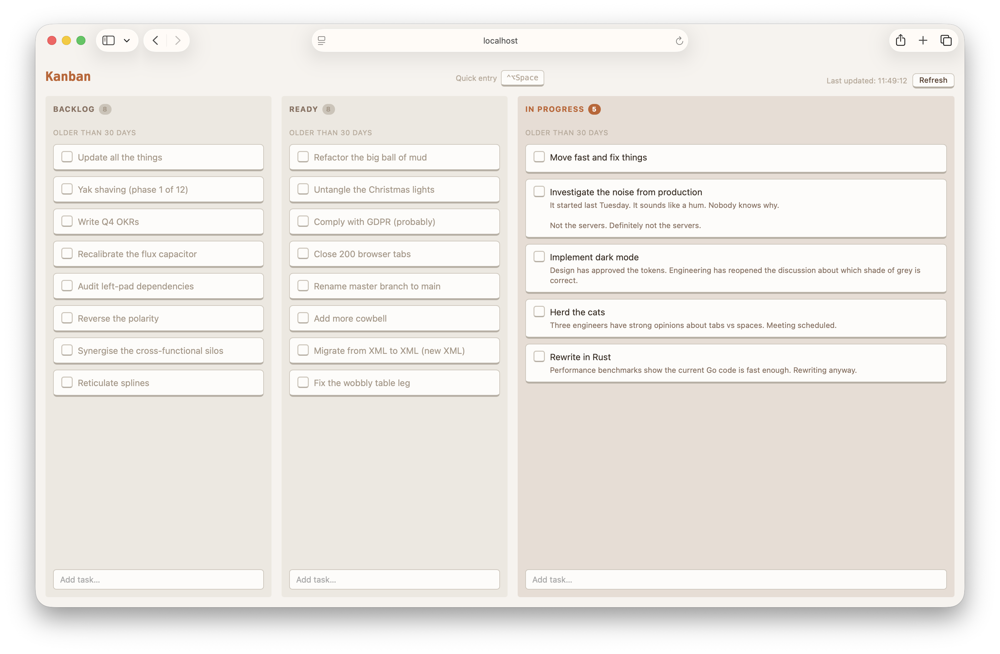

# Omnikan

Omnikan is a Kanban board view for your [Omnifocus](https://www.omnigroup.com/omnifocus/) tasks.



## Set up

1. Create a [mutually-exclusive set of tags](https://learnomnifocus.com/tutorial/simplify-tagging-with-mutually-exclusive-tags-in-omnifocus/):

    - `kanban:backlog`
    - `kanban:ready`
    - `kanban:inprogress`

2. Create a project for your kanban board; Omnikan displays tasks from a single project.

3. Ensure Omnifocus is running

4. Start Omnikan:

    ```
    go run . -project "my project"
    ```

5. Open http://localhost:8080 (by default).

## Managing tasks

Adding tasks:

- To add a task in Omnifocus, add a new task to the Kanban project. It will automatically appear in the Backlog column.
- Alternatively, use the Add Task boxes in each column.

Editing tasks:

- The task title and note can be edited in Omnikan using the Edit button when you hover over a task.
- For more advanced edits, such as setting a defer date, use Omnifocus.

Tasks can either be completed by checking the checkbox, or deleted using the Delete button when you hover over a task. Completing a task can be undone within Omnikan for up to 60 seconds, but delete immediately deletes in Omnifocus.

## Troubleshooting

- Omnikan tries to show only Available tasks --- if a task isn't appearing, check it's not deferred.
- Tasks don't appear immediately, there is a background refresh timer. Use the Refresh button to force a refresh of Omnikan's view of the Omnifocus data.

## Background

Omnikan uses a running Omnifocus as its data backend. It uses Omnifocus JavaScript automation to communicate with the backend --- generating the board, moving tasks between columns (by updating Omnifocus tags) and completing tasks.

Why use OmniFocus as the backend? Because that gives me a powerful iOS application to manage tasks without my having to write one.
